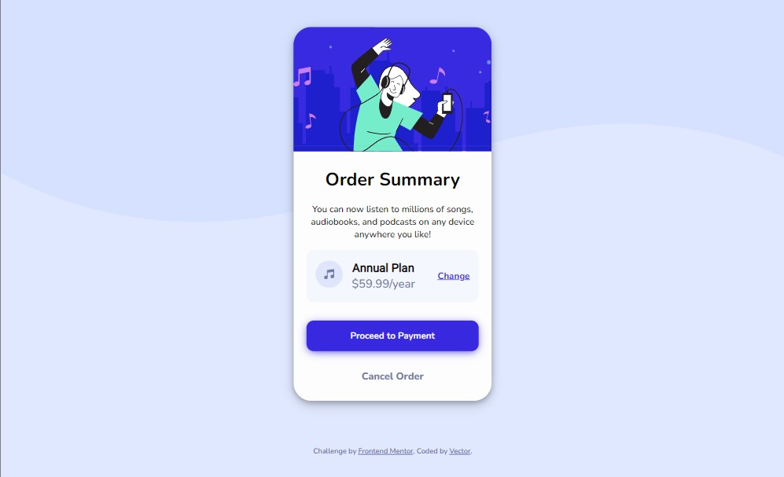

# Frontend Mentor - Order summary card solution

This is a solution to the [Order summary card challenge on Frontend Mentor](https://www.frontendmentor.io/challenges/order-summary-component-QlPmajDUj). Frontend Mentor challenges help you improve your coding skills by building realistic projects. 

## Table of contents

- [Overview](#overview)
  - [The challenge](#the-challenge)
  - [Screenshot](#screenshot)
  - [Links](#links)
- [My process](#my-process)
  - [Built with](#built-with)
  - [What I learned](#what-i-learned)
  - [Continued development](#continued-development)
  - [Useful resources](#useful-resources)
- [Author](#author)
- [Acknowledgments](#acknowledgments)

**Note: Delete this note and update the table of contents based on what sections you keep.**

## Overview

### The challenge

Users should be able to:

- See hover states for interactive elements

### Screenshot




### Links

- Solution URL: [Solution on Frontend mentor](https://www.frontendmentor.io/solutions/order-summary-page-using-html-and-css-uY2vumA1ig)
- Live Site URL: [Live Site](https://order-summary-page1.netlify.app/)

## My process

### Built with

- Semantic HTML5 markup
- CSS custom properties
- Flexbox
- CSS Grid
- Mobile-first workflow

### What I learned

I learnt to use Utility classes in CSS and how it can make me to write faster and cleaner code, I also learnt how to properly use the box-shadow CSS property and lastly how to prevent text from over-flowing

To see how you can add code snippets, see below:


```css
:root {
    /* colors */
    --pale-blue: hsl(225, 100%, 94%);
    --bright-blue: hsl(245, 75%, 52%);
    --v-pale-blue: hsl(225, 100%, 98%);
    --desaturated-blue: hsl(224, 23%, 55%);
    --dark-blue: hsl(223, 47%, 23%);
}

.plan {
    font-family: 'Roboto', sans-serif;
    font-weight: 800;
    font-size: 1.1em;
    white-space: nowrap;
    margin-bottom: none;
    color: var(--dark-blue);
    /* outline: 2px solid black; */
}
```


### Continued development

I wish to focus and improve on my CSS flexbox, positioning, CSS grid and basically get more comfortable writing CSS.


### Useful resources

- [Stack Overflow](https://stackoverflow.com/questions/6667081/keep-a-line-of-text-as-a-single-line-wrap-the-whole-line-or-none-at-all) - This helped me with a css code snippet that functions to keep text in a single line. I really liked this pattern and will use it going forward.
- [MDN](https://developer.mozilla.org/en-US/docs/Web/CSS/box-shadow) - This documentation on CSS box-shadow was the explanation I needed to fully understand this concept helped me greatly in my button styling. I'd recommend it to anyone still learning this concept.


## Author

- Website - [Vector](https://www.your-site.com)
- Frontend Mentor - [@VectorGits](https://www.frontendmentor.io/profile/VectorGits)
- Twitter - [@Vector_keen](https://www.twitter.com/Vector_keen)


## Acknowledgments

Special thanks to [Ayo](https://github.com/Ayblue004) who provided some assistance to me in my CSS when I got stuck

